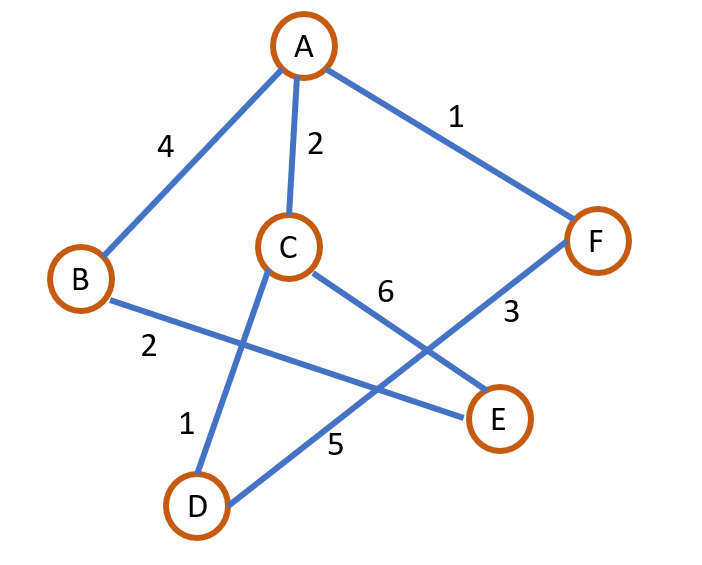
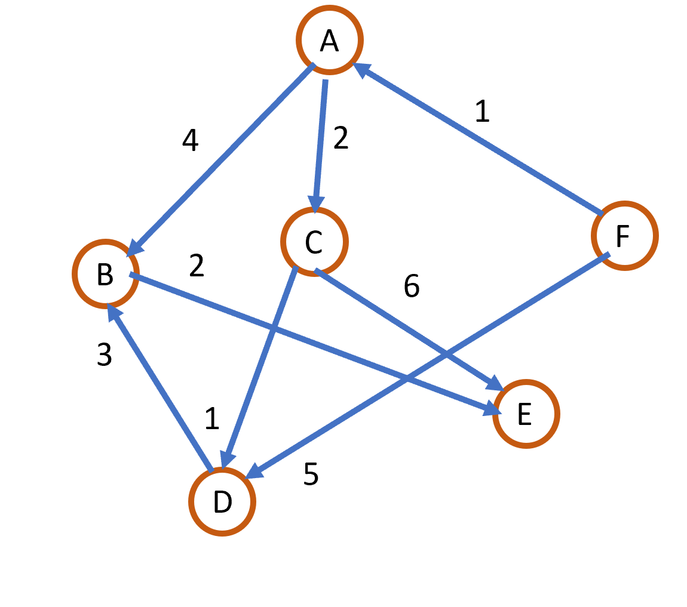
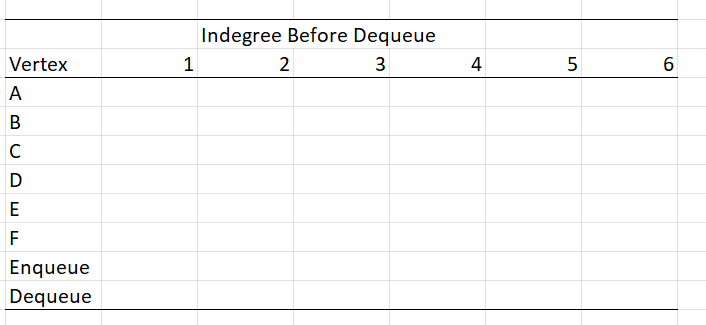
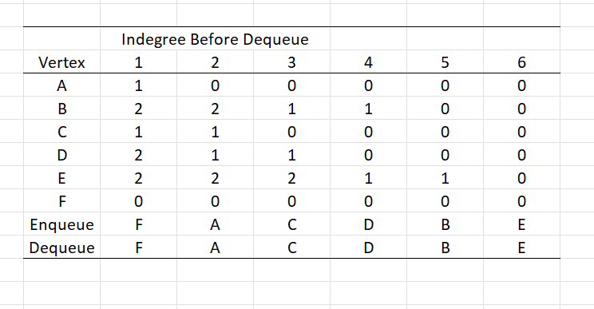
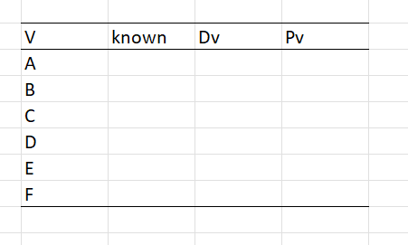
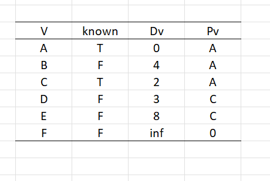

Question 1

Write the storage representation for following data.

Question 2

Identify the following method and complete it with question 1 data.

Question 3

What would be the configuration after C is known for Dijkstra’s algorithm for question 2?

